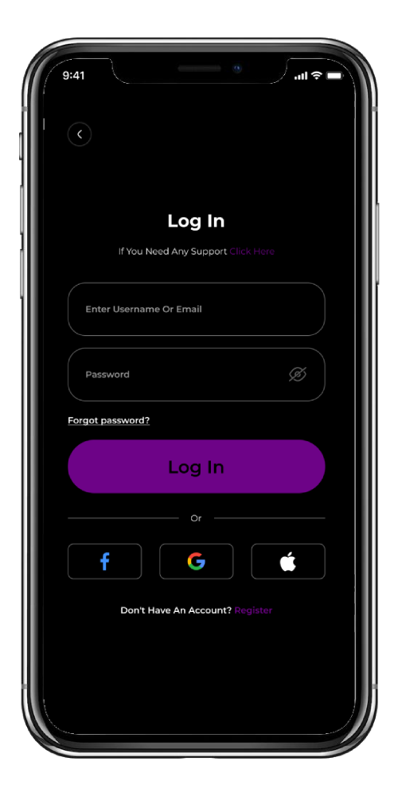
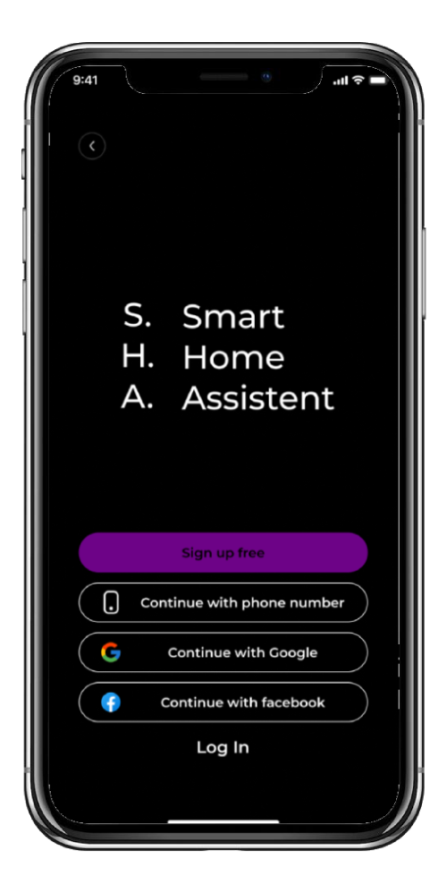
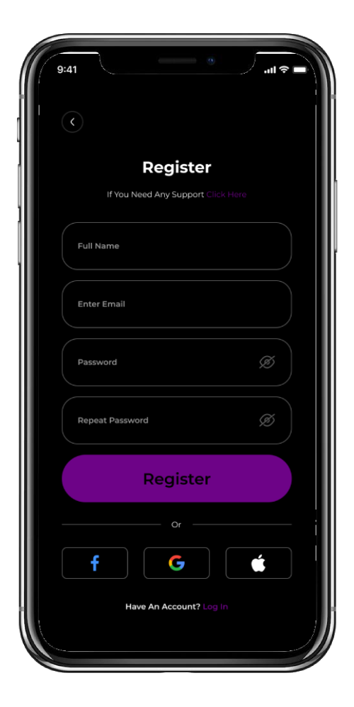
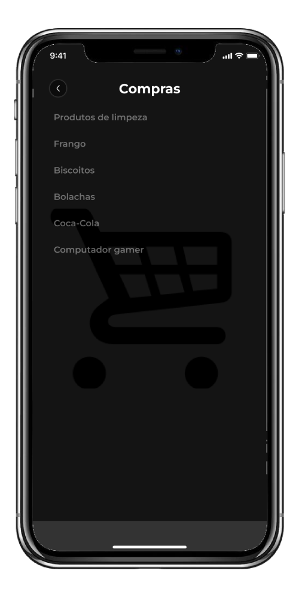

# PACIV20232-GRUPO3
# SHA - Smart Home Assistant

## Screenshots

  
  
  
  
  

O SHA (Smart Home Assistant) é um aplicativo projetado para simplificar e melhorar a gestão da sua casa, ajudando nas tarefas diárias e na organização do ambiente doméstico e atividades pessoais relacionadas ao lar e conforto.

## Funcionalidades

- **Controle Inteligente**: O SHA permite controlar vários dispositivos e sistemas em sua casa, como iluminação, temperatura, segurança e muito mais, tudo em um só lugar.

- **Agendamento de Tarefas**: Crie agendamentos para dispositivos e tarefas, tornando sua casa mais eficiente e automatizada.

- **Lembretes Personalizados**: Configure lembretes para tarefas diárias, como regar as plantas, fazer compras ou realizar tarefas domésticas.

- **Integração com Assistente de Voz**: O SHA pode ser integrado com assistentes de voz populares, como Alexa e Google Assistant, para controle por voz.

- **Segurança Avançada**: Mantenha sua casa segura com recursos avançados, como monitoramento de câmeras e notificações em tempo real.

- **Personalização**: Adapte o SHA de acordo com suas necessidades, adicionando novos dispositivos e personalizando a interface.

## Pré-requisitos

- [Flutter](https://flutter.dev/) e [Dart](https://dart.dev/) instalados no seu ambiente de desenvolvimento.

